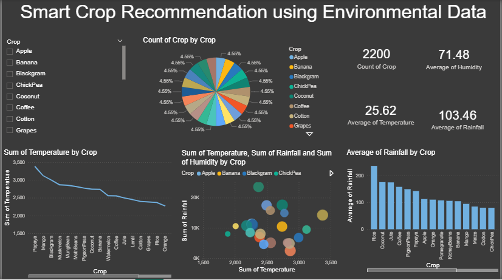

# Smart Crop Recommendation using Environmental Data 🌱

1)Project Overview
This project uses environmental parameters such as temperature, rainfall, and humidity to analyze and recommend suitable crops using Power BI.
2)Tools Used
- Power BI Desktop
- Dataset (CSV / Excel)
- GitHub
3)Dashboard Features
- Crop-wise distribution
- Average temperature, rainfall, and humidity
- Interactive filters and visuals
4)Files
- `Smart-Crop-Recommendation.pbix` – Power BI dashboard file
- `dataset.csv` – Dataset used
- `dashboard.png` – Dashboard preview
5)Author
  Pravallika Smart_Crop_Recomendation
Power BI dashboard for smart crop recommendation using environmental data
  Dashboard Preview

